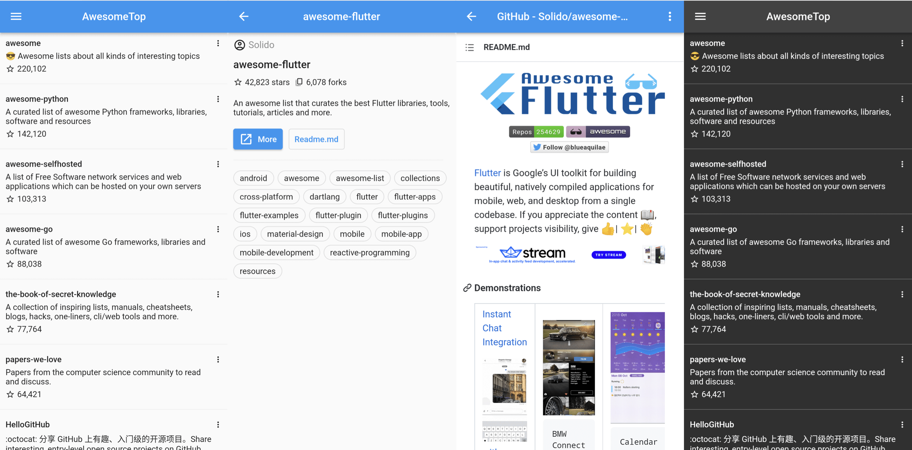

# AwesomeTop
A Flutter project of awesome top list.

## Screenshot


## Getting Started
This project use Flutter 3.0.5

### Get packages in a Flutter project.
```shell
$ flutter pub get
```

### Adding a launcher icon
```shell
$ flutter pub run flutter_launcher_icons:main
```